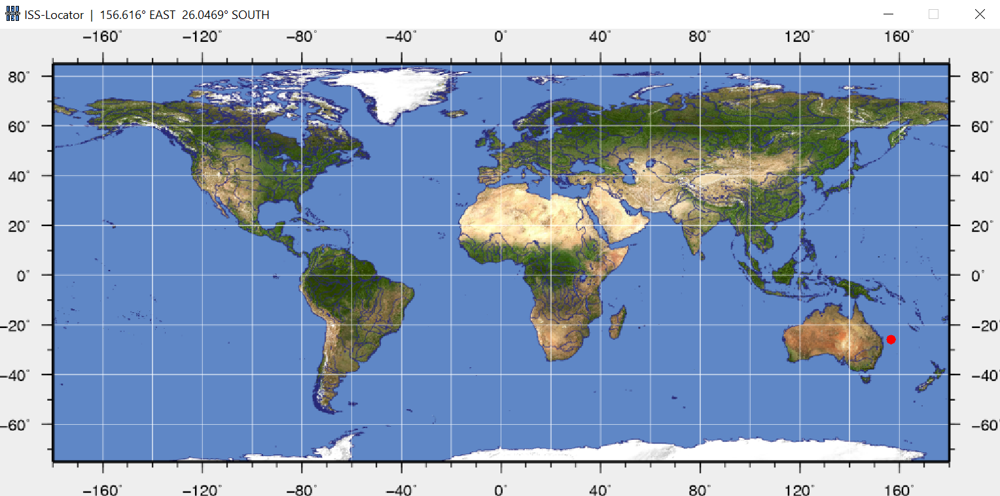

# ISS-Locator
**ISS-Locator** is a demo project for testing simple API integration in Java.

---

## Features
- displays the current position of the International Space Station on the world map
- displays the current coordinates of the International Space Station (longitude and latitude)

### Preinstalled dependencies
- [JSON (20220320)](https://mvnrepository.com/artifact/org.json/json/20220320)

### API Documentation
- [Open Notify - ISS Current Location](http://open-notify.org/Open-Notify-API/ISS-Location-Now/)

